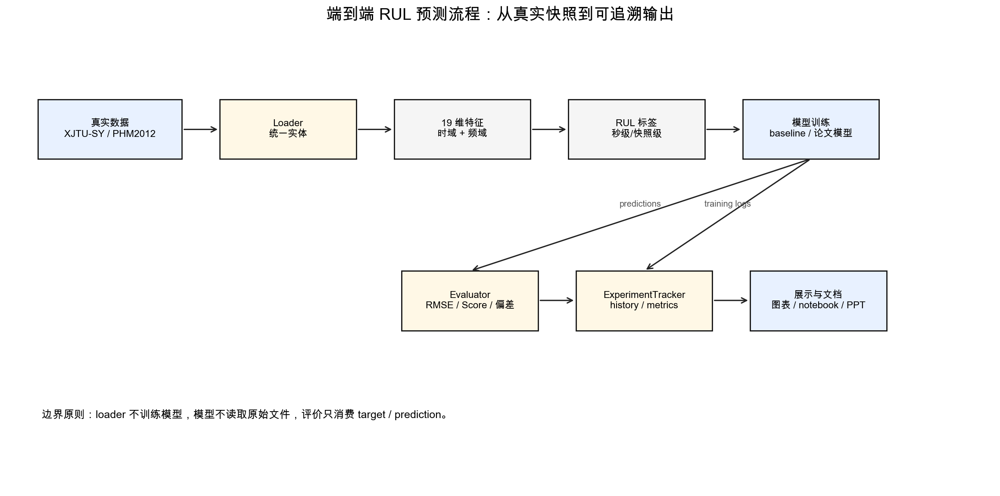

# 系统从 0 到 1 总览说明

本文档从项目 owner 视角介绍“工业轴承设备剩余寿命预测系统的实现”。它不是算法清单，而是把业务问题、数据语义、样本构造、系统设计、模型实验、指标解释和验收证据连成一条可复查的主线。

## 1. 项目要解决的问题

工业轴承是旋转机械中的关键部件。对维护人员来说，最直接的问题不是给当前状态贴一个离散类别，而是判断设备还能稳定运行多久。本项目因此把主任务定义为 RUL 回归预测，即根据轴承振动快照和退化特征估计 Remaining Useful Life。

项目面向三类使用者：

| 使用者 | 关心的问题 | 系统提供的证据 |
| --- | --- | --- |
| 实验开发者 | 数据能否导入、特征和标签是否正确 | loader、labeler、notebook、pytest |
| 课程评审人员 | 项目是否真实实现并可运行 | 训练记录、指标表、测试报告、课程文档 |
| 后续维护者 | 能否替换数据集或模型 | 分层模块、统一 API、输出格式说明 |

## 2. 输入、处理和输出

系统输入是 run-to-failure 轴承振动数据。当前支持两个真实数据集：XJTU-SY 和 PHM2012/FEMTO。二者都包含按时间排列的振动快照，但快照长度、间隔、目录结构和 RUL 语义不同。

核心处理链路如下：

1. `XJTULoader` 或 `PHM2012Loader` 将原始目录整理成 `BearingEntity`。
2. `SignalFeatureExtractor` 从水平或垂直振动信号中提取 19 维时域/频域特征。
3. `BearingRulLabeler` 或 `FeatureSequenceRulLabeler` 构造 RUL 监督目标。
4. `BaseTrainer` 训练 CNN、MLP、Transformer、CNN-LSTM-AM、XLSTM-Transformer 等模型。
5. `BaseTester` 和 `Evaluator` 输出预测值、误差指标、论文 Score 和方向性偏差。
6. `ExperimentTracker` 将 `history.csv`、`metrics.json`、`predictions.csv` 等文件落盘。

输出不是单个数字，而是一组可解释材料：

| 输出 | 用途 |
| --- | --- |
| `history.csv` | 证明训练 epoch 实际执行，观察 loss/RMSE 变化 |
| `metrics.json` | 保存一次模型评估的指标摘要 |
| `predictions.csv` | 保存每个样本的真实 RUL 和预测 RUL |
| `comparison_metrics.csv` | 汇总论文复现中多个模型、数据集和指标 |
| 特征趋势图 | 解释数据退化规律 |
| notebook | 给出可运行的用户入口 |

## 3. 三种运行入口

本项目不是只有一种运行方式。为了兼顾课程演示、真实数据实验和测试稳定性，系统保留三类入口。

| 入口 | 适用场景 | 数据来源 | 说明 |
| --- | --- | --- | --- |
| `uv run python main.py` | 快速演示主流程 | 合成数据 | 用于证明 API 链路和训练输出可运行 |
| `examples/*.ipynb` | 用户学习和复现实验 | demo 或真实数据 | 全部 notebook 纳入 smoke test |
| `run_paper_*_reproduction` | 论文复现验收 | `data/external` 真实数据 | 输出论文指标表和训练证据 |

这三类入口的定位必须区分清楚：`main.py` 证明系统链路，notebook 证明用户可操作，论文复现 workflow 证明真实数据训练和指标体系。

## 4. 模块边界

源码主命名空间是 `USTC.SSE.BearingPrediction`。当前工程按数据流分层：

| 层次 | 主要模块 | 职责 |
| --- | --- | --- |
| 数据层 | `dataset`、`data` | 扫描目录、读取快照、构造 `BearingEntity` |
| 处理层 | `preprocess`、`feature`、`labeling` | 预处理、特征提取、RUL/阶段标签 |
| 模型层 | `models` | PyTorch 模型结构 |
| 训练层 | `training`、`prediction` | 训练、测试、预测模式和实验记录 |
| 评价层 | `evaluation` | 普通误差、RUL Score、方向性指标 |
| 展示层 | `visualization`、`examples` | 图表、notebook 和报告素材 |

关键设计原则是：loader 不训练模型，模型不读取原始文件，评价器只消费 `target` 和 `prediction`。这样两个数据集和多种模型可以共用同一条实验链路。

## 5. 当前能力与边界

已经完成并有证据支撑的能力：

- XJTU-SY 和 PHM2012 数据加载。
- 19 维时频域特征提取。
- RUL 标签和特征序列标签构造。
- CNN、RNN、MLP、Transformer、CNN-LSTM-AM、XLSTM-Transformer 训练。
- RMSE、NormalizedRMSE、R2、SMAPE、Huang RUL Score、PHM/RUL 惩罚 Score 和方向性指标。
- 两篇 RUL 论文工程化复现。
- 8 个 notebook 和 31 个自动化测试。

需要明确边界：

- 本项目主线是剩余寿命预测，不展开离散状态识别任务。
- 生存分析和失效概率是扩展接口，结题主验收仍然是 RUL 预测。
- 论文复现是“论文结构 + 项目特征管线适配 + 真实训练 workflow”，不声称作者源码级复刻或完整 epoch 数值对齐。

## 6. 证据索引

| 主张 | 证据 |
| --- | --- |
| 支持两个真实数据集 | `XJTULoader`、`PHM2012Loader`、`tests/test_data_io_and_loaders.py` |
| 提取 19 维特征 | `SignalFeatureExtractor`、`tests/test_paper_cnn_lstm_attention.py` |
| RUL 标签按时间语义构造 | `BearingRulLabeler`、`FeatureSequenceRulLabeler`、`docs/DATASETS.md` |
| 训练真实执行 | `BaseTrainer`、`ExperimentTracker`、`history.csv` |
| 论文指标可输出 | `HuangRulScore`、`PHM2012Score`、`docs/PAPER_REPRODUCTION.md` |
| notebook 可运行 | `tests/test_examples_notebooks.py` |
