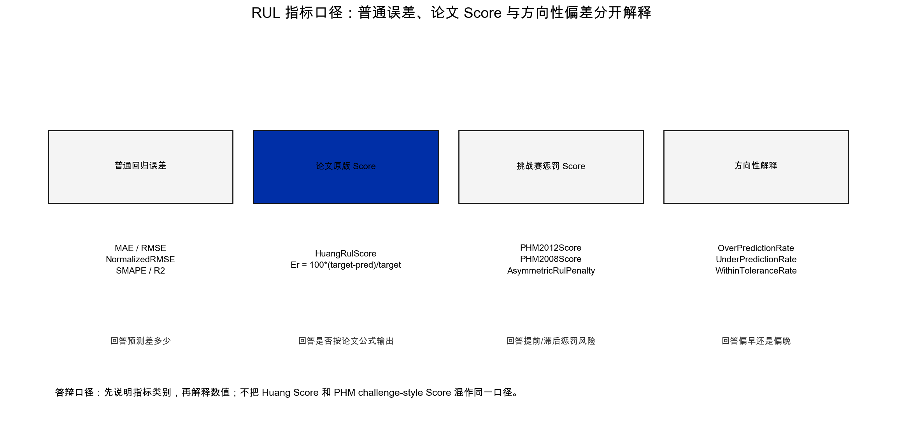

# 模型与实验设计说明

本项目的模型设计不是为了堆叠复杂结构，而是围绕 RUL 预测任务建立可解释、可复现、可比较的实验链路。

## 1. 为什么先做 19 维特征

原始振动快照长度不同：XJTU-SY 每个快照 32768 点，PHM2012 每个加速度文件 2560 点。直接输入原始信号可以保留细节，但对课程项目来说训练成本高，也不利于解释数据规律。

因此论文复现主线采用 19 维时频域特征：

| 类型 | 示例 | 解释 |
| --- | --- | --- |
| 强度特征 | RMS、峰值、谱能量 | 观察振动强度是否随退化增强 |
| 冲击特征 | 峭度、峰值因子、脉冲因子 | 捕捉后期尖峰和冲击 |
| 稳定性特征 | 均值、方差、标准差 | 描述整体偏移和波动 |
| 频谱特征 | 主频、谱质心、谱熵 | 补充频率分布变化 |

这些特征由 `SignalFeatureExtractor` 输出，并被 `FeatureSequenceRulLabeler` 组织成时间序列输入。

完整 19 维字段如下。这里的“14 个时域特征 + 5 个频域特征”是项目主线自己用 NumPy/FFT 实现的默认特征集合，不是调用 `tsfresh` 自动生成特征。`tsfresh` 和 `xgboost` 在仓库中只作为可选扩展依赖，不作为本轮论文复现的主输入来源。

| 序号 | 字段 | 类别 | 计算含义 | 作用 |
| ---: | --- | --- | --- | --- |
| 1 | `mean` | 时域/稳定性 | `mean(x)` | 观察信号整体偏移 |
| 2 | `variance` | 时域/稳定性 | `var(x)` | 描述波动强度 |
| 3 | `standard_deviation` | 时域/稳定性 | `std(x)` | 方差的同量纲表达 |
| 4 | `rms` | 时域/强度 | `sqrt(mean(x^2))` | 表征振动有效强度 |
| 5 | `peak` | 时域/强度 | `max(abs(x))` | 捕捉最大冲击幅值 |
| 6 | `peak_to_peak` | 时域/强度 | `max(x)-min(x)` | 描述全幅值范围 |
| 7 | `absolute_mean` | 时域/强度 | `mean(abs(x))` | 作为形状类特征分母 |
| 8 | `shape_factor` | 时域/冲击 | `rms/absolute_mean` | 反映波形形状变化 |
| 9 | `crest_factor` | 时域/冲击 | `peak/rms` | 反映尖峰相对有效值 |
| 10 | `impulse_factor` | 时域/冲击 | `peak/absolute_mean` | 反映瞬时冲击程度 |
| 11 | `margin_factor` | 时域/冲击 | `peak/(mean(sqrt(abs(x)))^2)` | 对局部冲击更敏感 |
| 12 | `clearance_factor` | 时域/冲击 | 当前实现与 `margin_factor` 相同 | 保留论文特征名兼容性，不单独宣称物理差异 |
| 13 | `kurtosis` | 时域/冲击 | 四阶中心矩 / 方差平方 | 识别后期尖峰和冲击 |
| 14 | `skewness` | 时域/稳定性 | 标准化三阶矩 | 观察分布不对称 |
| 15 | `dominant_frequency` | 频域 | 非 DC 最大 FFT 幅值对应频率 | 识别主要振动频率 |
| 16 | `spectrum_energy` | 频域/强度 | `sum(abs(rfft(x))^2)` | 衡量频谱总能量 |
| 17 | `spectral_centroid` | 频域 | `sum(f*power)/sum(power)` | 描述频谱能量重心 |
| 18 | `spectral_rms_frequency` | 频域 | `sqrt(sum(f^2*power)/sum(power))` | 描述频率均方根 |
| 19 | `spectral_entropy` | 频域 | `-sum(p*log2(p))` | 描述频谱分散程度 |

综合健康指标并不是把 19 维简单求平均。当前 `build_health_indicator` 只选用 `rms`、`kurtosis`、`crest_factor`、`spectrum_energy`，先做标准化再求均值并归一化，目的是把强度、冲击和频谱能量压缩成一条便于观察的趋势曲线。

## 2. 第一篇论文：CNN-LSTM-AM

Huang 等 2024 年 CNN-LSTM-AM 的核心思想是：

1. 用 19 维特征描述每个快照；
2. 用 CNN 提取局部模式；
3. 用 LSTM 建模时间依赖；
4. 用 attention 聚合关键时间步；
5. 输出 RUL 回归预测。

项目实现中，`CNNLSTMAttention(use_attention=True)` 对应 CNN-LSTM-AM，`use_attention=False` 对应 CNN-LSTM baseline。这样可以在同一套训练器和数据集上比较 attention 是否带来变化。

真实训练摘要：

| 数据集/工况 | 模型 | RMSE | NormalizedRMSE | Huang RUL Score | prediction_count | epoch |
| --- | --- | ---: | ---: | ---: | ---: | ---: |
| XJTU-SY condition_1_35Hz12kN | CNN-LSTM-AM | 0.146543 | 0.146543 | 0.792412 | 92 | 50 |
| XJTU-SY condition_1_35Hz12kN | CNN-LSTM | 0.180620 | 0.180620 | 1.396488 | 92 | 50 |
| PHM2012 condition_1 | CNN-LSTM-AM | 0.166840 | 0.222228 | 1.595291 | 92 | 50 |
| PHM2012 condition_1 | CNN-LSTM | 0.185602 | 0.247218 | 1.822512 | 92 | 50 |

解释：按 RMSE 看，50 epoch relative RUL 正式训练中 attention 版本在 XJTU-SY 和 PHM2012 上均低于 baseline。Huang Score 是惩罚型分数，同一口径下越小越好；论文 reported Score 另有方向口径，因此正式对照优先看 normalized RMSE 和 RMSE 降幅。

该表来自 `comparison_metrics.csv` 的摘要版本。第一篇复现的测试预测数由 `prediction_count` 记录，训练过程由每个模型目录下的 `history.csv` 记录；答辩时应同时说明“有预测样本、有 epoch 历史、有对比表”，而不是只展示最终 RMSE。

## 3. 第二篇论文：xLSTM-Transformer

Jiang 等 2026 年 xLSTM-Transformer 适合作为第二篇复现，因为它同时覆盖 XJTU-SY 和 PHM2012，并公开训练/测试轴承划分、序列长度、学习率、epoch 和 RMSE/R2/Score 指标。

项目实现包含三类模型：

| 模型 | 用途 |
| --- | --- |
| `XLSTM-Transformer` | 论文结构复现主模型 |
| `Feature-Transformer` | 去掉 xLSTM 分支的 Transformer baseline |
| `LSTM-Transformer` | LSTM 与 Transformer 组合 baseline |

真实训练中，XJTU-SY 三工况和 PHM2012 三工况均完成 50 epoch、每轴承 96 快照、relative RUL 训练。下表采用追加快照时间位置特征后的 xLSTM-Transformer 实验输出，用于展示当前最接近论文 RMSE/R2 的本地结果：

| 数据集/工况 | RMSE | NormalizedRMSE | R2 | PHM2012 Score | Huang RUL Score |
| --- | ---: | ---: | ---: | ---: | ---: |
| XJTU-SY Condition 1 | 0.064558 | 0.064558 | 0.950555 | 66.839 | 0.749011 |
| XJTU-SY Condition 2 | 0.160142 | 0.160142 | 0.698626 | 397.745 | 0.953319 |
| XJTU-SY Condition 3 | 0.067241 | 0.067241 | 0.946986 | 66.774 | 0.881805 |
| PHM2012 Condition 1 | 0.138829 | 0.187602 | 0.587010 | 177.519 | 1.395230 |
| PHM2012 Condition 2 | 0.221128 | 0.374170 | -0.643896 | 507.973 | 1.816222 |
| PHM2012 Condition 3 | 0.085566 | 0.107630 | 0.863951 | 88.101 | 0.949031 |

PHM2012 Condition 2 的负 R2 表示当前抽样设置和模型实现下，该工况拟合弱于均值基线。这不是要掩盖的缺点，而是复现边界的一部分。

PHM2012 Score 数值较大，说明少数相对误差触发了指数惩罚。它暴露的是当前 96 快照抽样和单次训练仍然不足，而不是 Score 实现错误。完整 18 行 baseline 对比保存在 `docs/PAPER_REPRODUCTION.md`。

## 4. 指标怎么读

RUL 指标需要分层解释：

| 类别 | 指标 | 答案 |
| --- | --- | --- |
| 普通回归误差 | RMSE、MAE、NormalizedRMSE、SMAPE、R2 | 预测值离真实 RUL 有多远 |
| 论文原版 Score | HuangRulScore | 是否按论文相对误差公式输出 |
| 挑战赛惩罚 Score | PHM2012Score、PHM2008Score | 提前/滞后预测的非对称惩罚 |
| 方向性解释 | OverPredictionRate、UnderPredictionRate、WithinToleranceRate | 模型偏早还是偏晚 |

答辩中应先说明指标口径，再解释数值。不能把 Huang Score 和 PHM2012 challenge-style Score 混成同一种指标；Huang Score 完美预测为 0，同一口径下越小越好。

## 5. 实验边界

本项目复现的是论文结构、训练流程、数据划分思想和指标体系。它不声称：

- 逐行复刻作者源码；
- 完整执行论文中的全部 epoch 和全部样本；
- 单次 50 epoch 抽样结果代表作者源码级最终性能；
- 当前模型已经达到工业部署级效果。

更严谨的后续实验应扩大样本量、增加 epoch、补充多随机种子，并对不同工况做统计显著性分析。
