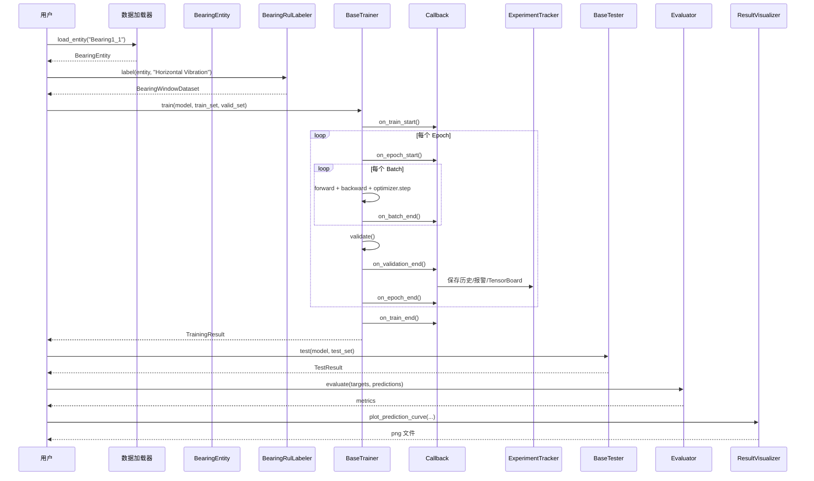
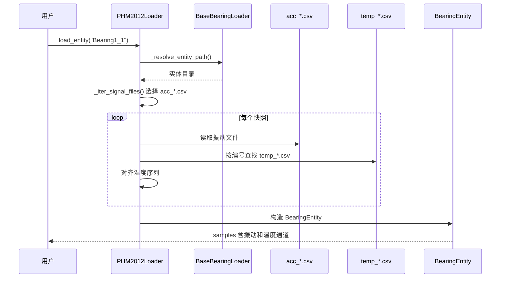
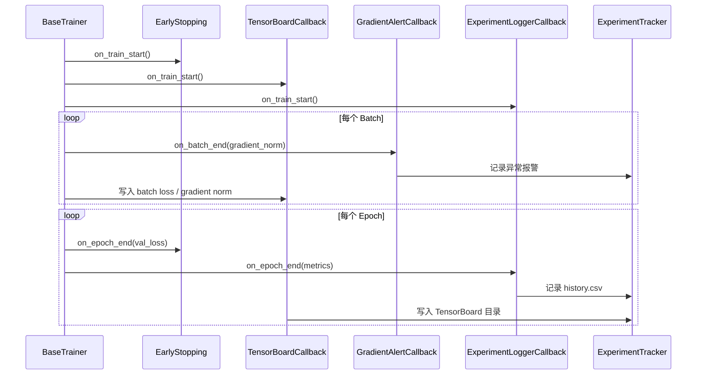
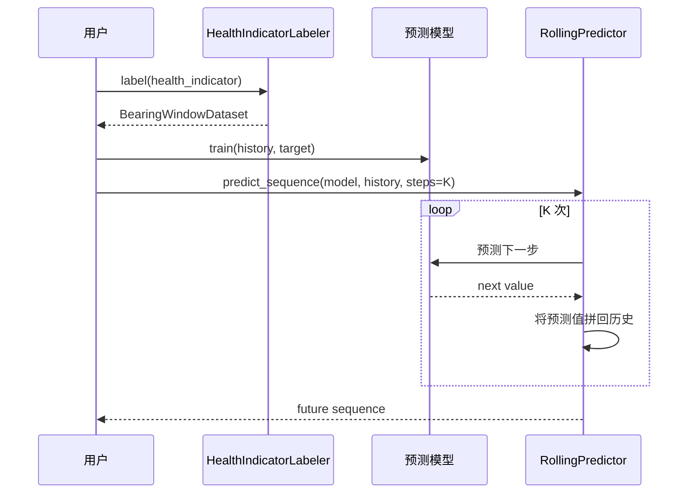
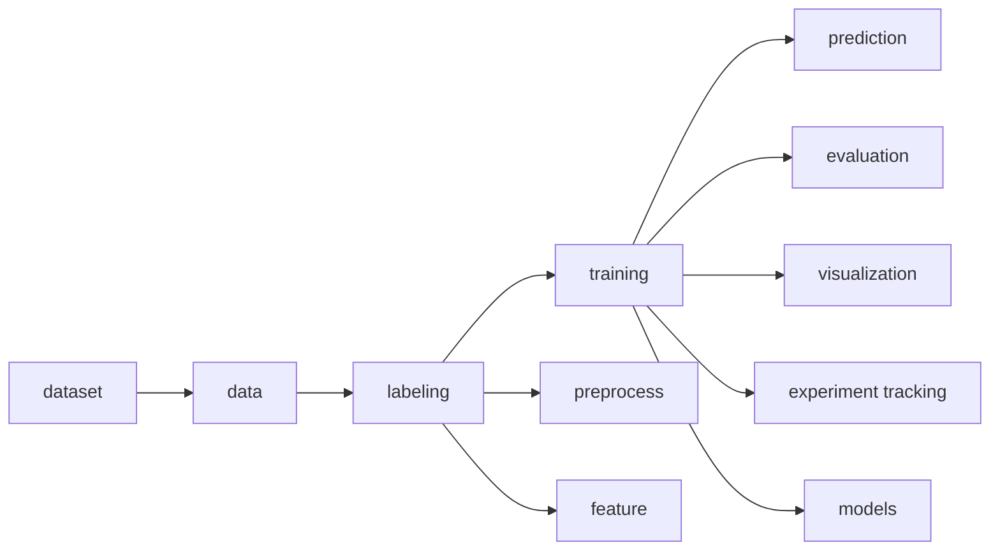

# 工业轴承故障预测系统 UML 设计文档

## 文档信息

| 项目 | 内容 |
| --- | --- |
| 文档名称 | 工业轴承故障预测系统 UML 设计文档 |
| 版本 | V1.1 |
| 编写时间 | 2026-03-12 |
| 说明 | 本文档包含类图、时序图及配套文字说明 |
| 指导老师 | zjf |
| 项目成员 | zyj、cyy、zdh、zy |
| 文档负责人 | zyj、zy |
| 参与编写 | cyy、zdh |
| 本文档侧重分工 | 总体类图与训练主流程由 zyj 牵头；展示链路与图示表达由 zy 负责补充；数据与生存分析相关关系由 cyy、zdh 参与校对 |

## 项目成员与任务分工

| 成员 | 职责 | 在本文档中的对应内容 |
| --- | --- | --- |
| zyj | 项目负责人、系统架构、RUL 模型 | 总体类图、训练顺序图、核心关系说明 |
| cyy | 数据工程、数据处理、特征工程 | 数据加载、预处理、特征提取相关类关系校对 |
| zdh | 生存分析 | 生存分析扩展关系与指标相关对象校对 |
| zy | 可视化 | 可视化对象关系、展示链路、图示表达优化 |

---

## 1. UML 设计目标

UML 文档的作用不是简单画图，而是将系统中的核心对象、关系和运行过程可视化，使评审人员能够快速理解：

1. 系统由哪些关键类构成。
2. 类之间如何协作。
3. 一次实验从数据加载到可视化输出的完整流程是什么。
4. 回调、实验记录和预测器这些扩展能力是如何嵌入主流程的。

---

## 2. 类图

### 2.1 核心类图

```mermaid
classDiagram
    class BearingEntity {
        +str entity_id
        +str dataset_name
        +DataFrame samples
        +float sample_rate
        +dict metadata
        +channel_names() list[str]
        +get_channel(channel_name) list[np.ndarray]
        +export(output_path)
    }

    class BearingWindowDataset {
        +ndarray inputs
        +ndarray targets
        +DataFrame metadata_frame
        +str task_type
        +str target_name
        +str input_name
        +split_by_ratio(train_ratio)
        +as_frame()
        +export(output_path)
    }

    class BaseBearingLoader {
        +Path data_root
        +list_entities() list[str]
        +load_entity(entity_id) BearingEntity
    }

    class XJTULoader
    class PHM2012Loader

    class BearingRulLabeler {
        +label(entity, channel_name) BearingWindowDataset
    }

    class BearingStageLabeler {
        +label(entity, channel_name) tuple
    }

    class HealthIndicatorLabeler {
        +label(health_indicator) BearingWindowDataset
    }

    class BaseBearingModel {
        +forward(inputs)
        +get_monitor_state()
    }

    class CNN
    class RNN
    class Transformer
    class MLP

    class BaseTrainer {
        +train(model, train_set, valid_set)
    }

    class BaseTester {
        +test(model, test_set, predictor=None)
    }

    class Callback {
        +on_train_start()
        +on_epoch_end()
        +on_train_end()
    }

    class EarlyStopping
    class TensorBoardCallback
    class GradientAlertCallback
    class ExperimentLoggerCallback

    class ExperimentTracker {
        +save_metrics(metrics)
        +save_predictions(frame)
    }

    class DirectPredictor
    class RollingPredictor
    class MonteCarloDropoutPredictor

    class Evaluator {
        +add(metrics)
        +evaluate(targets, predictions)
    }

    class ResultVisualizer {
        +plot_prediction_curve()
        +plot_confusion_matrix()
        +plot_degradation_stages()
        +plot_attention_heatmap()
    }

    BaseBearingLoader <|-- XJTULoader
    BaseBearingLoader <|-- PHM2012Loader

    BaseBearingModel <|-- CNN
    BaseBearingModel <|-- RNN
    BaseBearingModel <|-- Transformer
    BaseBearingModel <|-- MLP

    Callback <|-- EarlyStopping
    Callback <|-- TensorBoardCallback
    Callback <|-- GradientAlertCallback
    Callback <|-- ExperimentLoggerCallback

    BearingEntity --> BearingRulLabeler
    BearingEntity --> BearingStageLabeler
    BearingStageLabeler --> BearingWindowDataset
    BearingRulLabeler --> BearingWindowDataset
    HealthIndicatorLabeler --> BearingWindowDataset

    BaseTrainer --> Callback
    BaseTrainer --> ExperimentTracker
    BaseTrainer --> BaseBearingModel
    BaseTrainer --> BearingWindowDataset

    BaseTester --> BaseBearingModel
    BaseTester --> BearingWindowDataset
    BaseTester --> DirectPredictor
    BaseTester --> MonteCarloDropoutPredictor

    Evaluator --> BaseTester
    ResultVisualizer --> BaseTester
    RollingPredictor --> BaseBearingModel
```

### 2.2 类图说明

#### 2.2.1 数据核心对象

`BearingEntity` 表示真实轴承实体的原始快照集合，是数据接入层与任务层之间的桥梁。`BearingWindowDataset` 表示经过切窗与标注后的模型训练数据，是训练层与测试层的标准输入。

#### 2.2.2 数据集加载器

`XJTULoader` 与 `PHM2012Loader` 都继承自 `BaseBearingLoader`。这种继承关系体现了“公共逻辑下沉、数据集差异上浮”的设计原则。

#### 2.2.3 标注层

三个 Labeler 分别对应三类任务：

1. `BearingRulLabeler`：RUL 回归。
2. `BearingStageLabeler`：阶段分类。
3. `HealthIndicatorLabeler`：健康指标序列预测。

#### 2.2.4 模型层

所有模型都继承自统一基类接口，训练器和测试器只依赖抽象能力，而不依赖具体模型实现。

#### 2.2.5 训练扩展层

`Callback` 是训练扩展的统一接口，`EarlyStopping`、`TensorBoardCallback`、`GradientAlertCallback` 和 `ExperimentLoggerCallback` 通过继承实现插件化能力。

#### 2.2.6 结果输出层

`Evaluator` 负责指标聚合，`ResultVisualizer` 负责图像输出，二者都位于训练后处理阶段，避免和训练器耦合。

---

## 3. 类关系文字解释

### 3.1 继承关系

1. `XJTULoader` 和 `PHM2012Loader` 继承 `BaseBearingLoader`。
2. `CNN`、`RNN`、`Transformer`、`MLP` 继承 `BaseBearingModel`。
3. 各种回调继承 `Callback`。

继承关系体现的是“框架骨架固定，细节能力按类扩展”的思想。

### 3.2 依赖关系

1. `BaseTrainer` 依赖模型、数据集、回调和实验记录器。
2. `BaseTester` 依赖模型和预测器。
3. `Evaluator` 依赖测试结果输出。
4. `ResultVisualizer` 依赖测试结果和阶段划分结果。

### 3.3 组合关系

训练过程不是单一对象完成，而是多个组件共同完成：

1. 训练器组织流程。
2. 模型完成前向计算。
3. 回调完成监控和日志。
4. 记录器完成结果持久化。

这种关系更接近工程系统，而不是简单的算法脚本。

---

## 4. 时序图

### 4.1 真实数据 RUL 实验顺序图

#### 说明

这张图反映的是系统最核心的主流程。可以看到训练器并不直接负责日志和可视化，而是通过回调与记录器完成配套能力。这一设计是系统可扩展性的基础。

### 4.2 PHM2012 真实数据加载顺序图

#### 说明

这张图强调了一个真实数据设计点：PHM2012 不是只有振动数据，还伴随温度观测。系统设计上保留温度通道，避免在真实数据适配阶段丢失信息。

### 4.3 回调与训练监控顺序图

#### 说明

该时序图说明了“训练主逻辑”和“训练监控逻辑”是如何解耦的。回调机制让 EarlyStopping、TensorBoard 和梯度报警都成为横切能力，而不是嵌入训练器内部的条件分支。

### 4.4 健康指标滚动预测顺序图

#### 说明

滚动预测并不是一次性输出未来多个点，而是递推生成序列。该图说明了系统中时序预测能力的基本工作方式。

---

## 5. 组件视图

虽然本项目课程要求主要关注类图和顺序图，但从工程理解角度，增加组件视图有助于说明模块边界。

### 组件视图说明

1. `dataset` 负责读取真实文件。
2. `data` 负责统一数据对象。
3. `labeling` 位于中间层，是任务化的关键。
4. `training` 负责主流程调度。
5. `prediction`、`evaluation`、`visualization` 为训练后阶段能力。
6. `experiment tracking` 贯穿训练流程但不侵入模型本身。

---

## 6. UML 设计结论

从 UML 角度看，本系统的核心结构有三个突出特征：

1. 数据统一抽象先行，避免真实数据集差异污染上层流程。
2. 训练器、回调、实验记录器分离，体现出清晰的扩展边界。
3. 多任务共用一套主骨架，只在标注层和模型层发生差异。

这套 UML 设计既能支撑课程项目答辩中的系统结构解释，也能为后续继续扩展模型和数据集提供明确的架构依据。
