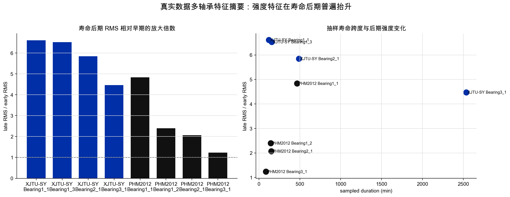

# 工业轴承设备剩余寿命预测系统的实现：数据语义与样本构造说明

## 文档信息

| 项目 | 内容 |
| --- | --- |
| 文档名称 | 数据语义与样本构造说明 |
| 文档编号 | SE-PHM-FINAL-23 |
| 文档阶段 | 结题 |
| 项目名称 | 工业轴承设备剩余寿命预测系统的实现 |
| 课程 | 中国科学技术大学软件学院《软件工程》 |
| 指导老师 | zjf |
| 小组成员 | zyj、cyy、zdh、zy |
| 文档负责人 | cyy |
| 参与编写 | zyj、zdh、zy |
| 版本 | V1.0 |
| 修订日期 | 2026-06-14 |
| 归档形式 | Markdown 源文件、PDF、DOCX |
| 内容基线 | 数据来源、采样语义、RUL 标签、样本构造、防泄漏原则 |

## 修订记录

| 版本 | 日期 | 编写人 | 说明 |
| --- | --- | --- | --- |
| V1.0 | 2026-06-14 | 项目组 | 新增两个真实数据集的数据语义和样本构造说明 |

## 1. 数据语义为什么重要

轴承 RUL 预测不能把原始文件只当作普通表格处理。每个文件代表一个按时间采集的振动快照，每个快照在全寿命序列中有明确顺序，每个窗口或特征序列都对应一个剩余寿命标签。如果忽略时间顺序，模型评估很容易产生数据泄漏，导致结果偏乐观。



## 2. 两个数据集的共同点和差异

XJTU-SY 与 PHM2012/FEMTO 都是 run-to-failure 轴承退化数据，适合做剩余寿命预测、健康指标构造和退化趋势分析。二者的差异主要体现在采样组织方式：

| 项目 | XJTU-SY | PHM2012/FEMTO |
| --- | --- | --- |
| 采样频率 | 25.6 kHz | 25.6 kHz |
| 单个快照点数 | 32768 | 2560 |
| 单个快照覆盖时长 | 1.28 s | 0.1 s |
| 快照间隔 | 约 1 min | 约 10 s |
| 通道 | 水平、垂直振动 | 水平、垂直振动，另有温度文件 |
| 组织方式 | 三工况、多个轴承完整寿命序列 | Learning/Test/Validation/Full_Test 竞赛语义 |

这说明两个 loader 的目标不是简单拼接文件，而是把不同数据源整理成统一的 `BearingEntity`。

## 3. `BearingEntity` 的统一含义

`BearingEntity` 是数据层向后续模块提供的统一实体。它包含：

| 字段 | 作用 |
| --- | --- |
| `entity_id` | 轴承编号，如 `Bearing1_1` |
| `dataset_name` | 数据集名称，如 `XJTU-SY` 或 `PHM2012` |
| `samples` | 按时间顺序排列的快照表 |
| `sample_rate` | 振动采样率 |
| `metadata` | 工况、时间间隔、RUL 单位、原始路径等 |

在 `samples` 中，最重要的列是 `sample_index`、`elapsed_seconds`、`rul`、水平/垂直振动信号和原始文件名。后续特征、标签和训练都建立在这些列之上。

## 4. 快照、窗口和特征序列

项目中有三个容易混淆的概念：

| 概念 | 含义 | 在系统中的用途 |
| --- | --- | --- |
| 快照 snapshot | 一次采样文件中的原始振动点 | loader 输出 |
| 窗口 window | 对单个长信号切分得到的片段 | 原始 CNN/RNN 模型输入 |
| 特征序列 feature sequence | 多个连续快照的 19 维特征拼成的序列 | 论文复现和特征模型输入 |

直接输入原始信号能保留更多细节，但计算成本较高，也不利于答辩中解释数据规律。本项目在论文复现主线中优先使用 19 维特征序列：每个快照先转成特征向量，再按时间顺序组成长度 5 或 10 的序列。

## 5. RUL 标签时间单位

对于完整寿命序列，RUL 的基本公式是：

```text
RUL_i = T_end - t_i
```

其中 `t_i` 是当前快照的运行时间，`T_end` 是该轴承最后一个有效快照对应的时间。XJTU-SY 可按约 1 分钟快照间隔换算；PHM2012 可按约 10 秒快照间隔换算。若只使用文件序号或抽样序号，输出中必须说明是快照级 RUL，不能误写成秒级寿命。

PHM2012 的 Test_set 还涉及官方给出的终止 RUL 条目。系统需要保留该信息来源，不能只用本地文件数推断真实终止寿命。

## 6. 多轴承特征观察

`scripts/generate_project_owner_assets.py` 从真实 `data/external` 中读取多个代表轴承，每个轴承抽样 80 个快照，并统计早期和后期 RMS 的变化。生成的 `multi-bearing-feature-summary.csv` 是本图的数据来源。

| 数据集 | 代表轴承 | 样本数 | RMS 后期/早期比值 | 观察 |
| --- | --- | ---: | ---: | --- |
| XJTU-SY | Bearing1_1 | 80 | 6.61 | 后期振动强度明显增强 |
| XJTU-SY | Bearing1_3 | 80 | 6.53 | 同工况下也存在退化曲线差异 |
| XJTU-SY | Bearing2_1 | 80 | 5.84 | 工况变化会改变寿命长度和幅值 |
| XJTU-SY | Bearing3_1 | 80 | 4.47 | 长寿命样本的退化更平缓 |
| PHM2012 | Bearing1_1 | 80 | 4.83 | 后期增强明显但波动更密集 |
| PHM2012 | Bearing1_2 | 80 | 2.39 | 同工况不同轴承差异明显 |
| PHM2012 | Bearing2_1 | 80 | 2.07 | 工况与样本长度共同影响特征 |
| PHM2012 | Bearing3_1 | 80 | 1.23 | 短序列中趋势不一定单调 |

这些结果说明，特征分析不能只展示单个轴承曲线。答辩中应说明代表图是局部证据，多轴承摘要用于补充统计视角。

## 7. 数据泄漏防范

RUL 是时间相关目标，不能把相邻窗口随机打散到训练集和测试集。否则模型可能在训练集中看到与测试样本高度相邻的退化片段，导致评估偏乐观。

本项目采用以下划分原则：

| 实验目标 | 推荐划分 |
| --- | --- |
| 快速演示 | 单轴承按时间顺序切分 |
| 同工况泛化 | 同一工况多个轴承训练，留一个轴承测试 |
| 论文复现 | 按论文给出的轴承编号和工况划分 |
| 跨工况分析 | 一个或多个工况训练，另一个工况测试 |

该原则在 xLSTM-Transformer 复现中体现得最明显：XJTU-SY 与 PHM2012 均按论文工况和轴承编号组织训练/测试。

## 8. 源码和测试依据

| 内容 | 源码依据 | 测试/输出依据 |
| --- | --- | --- |
| XJTU-SY 目录解析 | `dataset/xjtu.py` | `tests/test_data_io_and_loaders.py` |
| PHM2012 目录解析 | `dataset/phm2012.py` | loader 测试、复现 workflow |
| 统一实体 | `data/entities.py` | dataset split 测试 |
| 特征抽取 | `feature/engineering.py` | 19 维特征测试、特征摘要图 |
| RUL 序列标签 | `labeling/labelers.py` | feature sequence labeler 测试 |

