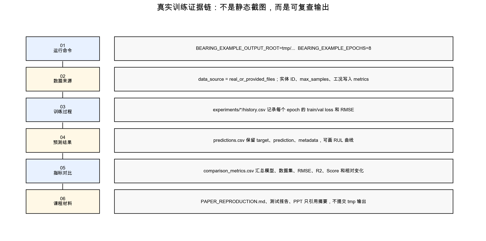

# 工业轴承设备剩余寿命预测系统的实现：端到端运行与输出解读手册

## 文档信息

| 项目 | 内容 |
| --- | --- |
| 文档名称 | 端到端运行与输出解读手册 |
| 文档编号 | SE-PHM-FINAL-24 |
| 文档阶段 | 结题 |
| 项目名称 | 工业轴承设备剩余寿命预测系统的实现 |
| 课程 | 中国科学技术大学软件学院《软件工程》 |
| 指导老师 | zjf |
| 小组成员 | zyj、cyy、zdh、zy |
| 文档负责人 | zy |
| 参与编写 | zyj、cyy、zdh |
| 版本 | V1.0 |
| 修订日期 | 2026-06-14 |
| 归档形式 | Markdown 源文件、PDF、DOCX |
| 内容基线 | 运行入口、训练输出、指标文件、常见问题 |

## 修订记录

| 版本 | 日期 | 编写人 | 说明 |
| --- | --- | --- | --- |
| V1.0 | 2026-06-14 | 项目组 | 新增端到端运行和输出文件解释 |

## 1. 运行前准备

项目使用 Python 3.11+ 与 `uv` 管理环境。首次运行建议执行：

```bash
uv sync --extra dev
```

若只运行演示流程，不需要下载真实数据；若运行两篇论文复现，需要在 `data/external` 下准备 XJTU-SY 和 PHM2012/FEMTO 数据。原始数据体积较大，不纳入 Git 归档。



## 2. 快速演示入口

快速演示命令：

```bash
uv run python main.py
```

该入口使用合成数据或轻量样例，适合检查 API、训练器、评价器和可视化输出是否能够串联。它不能替代真实数据复现，但可作为环境安装后的第一步验证。

输出通常包括模型训练日志、指标摘要和基础图表。若该入口失败，应优先检查依赖安装、Python 版本和输出目录权限。

## 3. Notebook 入口

`examples/` 下的示例全部采用 notebook 形式，覆盖数据集介绍、loader 使用、特征分析、RUL 训练、论文复现和可视化。它们既是用户学习材料，也是自动化测试对象。

验证命令：

```bash
BEARING_EXAMPLE_EPOCHS=1 uv run --extra dev pytest tests/test_examples_notebooks.py -q
```

notebook smoke test 使用 1 epoch 设置，目的是确认示例单元能执行完成，而不是追求模型性能。

## 4. 论文复现入口

第一篇论文复现入口是 CNN-LSTM-AM：

```bash
BEARING_EXAMPLE_OUTPUT_ROOT=tmp/paper_repro_real_metrics \
BEARING_EXAMPLE_EPOCHS=8 \
uv run python -c "from examples.demo_workflows import run_paper_cnn_lstm_attention_reproduction; run_paper_cnn_lstm_attention_reproduction()"
```

第二篇论文复现入口是 xLSTM-Transformer：

```bash
BEARING_EXAMPLE_OUTPUT_ROOT=tmp/paper_repro_xlstm_transformer \
BEARING_EXAMPLE_EPOCHS=8 \
uv run python -c "from examples.demo_workflows import run_paper_xlstm_transformer_reproduction; run_paper_xlstm_transformer_reproduction()"
```

这两条命令要求本地能读取 `data/external` 真实数据。训练输出保存在 `tmp/` 下，不提交到仓库。

## 5. 主要输出文件解读

| 文件 | 产生阶段 | 主要字段 | 解读方式 |
| --- | --- | --- | --- |
| `history.csv` | 训练阶段 | epoch、loss、rmse、mae | 检查训练是否真实执行，epoch 行数是否符合设置 |
| `metrics.json` | 测试阶段 | rmse、mae、r2、score 等 | 保存单个模型的指标摘要 |
| `predictions.csv` | 测试阶段 | target、prediction、error | 检查逐样本 RUL 预测和偏差方向 |
| `comparison_metrics.csv` | 复现实验阶段 | dataset、model、metric columns | 比较不同模型、数据集和工况 |

答辩展示时，不应只展示最终 RMSE，还应说明这些文件共同构成训练证据链：有训练过程、有预测明细、有汇总指标、有对比表。

## 6. 指标文件关键列

第一篇 CNN-LSTM-AM 复现的 `comparison_metrics.csv` 应包含：

| 列名 | 含义 |
| --- | --- |
| `rmse` | RUL 预测的均方根误差 |
| `normalized_rmse` | 按 RUL 范围归一化后的 RMSE |
| `huang_rul_score` | Huang 等论文 Eq. 11-13 的 Score |
| `smape` | 对称平均绝对百分比误差 |
| `over_prediction_rate` | 预测寿命偏大的样本比例 |
| `within_10_percent_rate` | 误差落在 10% 容差内的比例 |
| `rmse_reduction_pct` | AM 相对 CNN-LSTM baseline 的 RMSE 变化 |
| `huang_score_change_pct` | AM 相对 baseline 的 Huang Score 变化 |

第二篇 xLSTM-Transformer 复现的 `comparison_metrics.csv` 应包含：

| 列名 | 含义 |
| --- | --- |
| `rmse` | 普通回归误差 |
| `normalized_rmse` | 归一化误差 |
| `r2_score` | 相对均值基线的拟合程度 |
| `phm2012_score` | PHM challenge-style 惩罚 score |
| `huang_rul_score` | 论文 Score 口径之一 |
| `prediction_count` | 测试样本数 |
| `epoch_count` | 实际训练 epoch 数 |
| `rmse_change_pct_vs_baseline` | 相对 baseline 的 RMSE 变化 |

## 7. 常见问题

| 问题 | 可能原因 | 处理方式 |
| --- | --- | --- |
| 真实复现找不到数据 | `data/external` 未放置原始数据 | 按 `docs/DATASETS.md` 准备数据目录 |
| notebook 执行慢 | epoch 或样本数过大 | 使用 `BEARING_EXAMPLE_EPOCHS=1` 做 smoke test |
| R2 为负 | 小样本、短训练下模型弱于均值基线 | 在文档中作为实验边界解释 |
| 指标数值看起来较大 | RUL 单位和 score 口径不同 | 先说明指标公式，再解释结果 |
| 输出目录混乱 | 多次实验写到同一位置 | 使用 `BEARING_EXAMPLE_OUTPUT_ROOT` 隔离输出 |

## 8. 验收依据

| 验收点 | 命令或文件 | 期望结果 |
| --- | --- | --- |
| notebook 可执行 | `tests/test_examples_notebooks.py` | 全部示例单元完成 |
| 指标列完整 | `comparison_metrics.csv` | 包含论文 score 和相对变化列 |
| 训练真实执行 | `history.csv` | epoch 行数与设置一致 |
| 输出可解释 | `predictions.csv`、`metrics.json` | 能追溯目标值、预测值和误差 |

