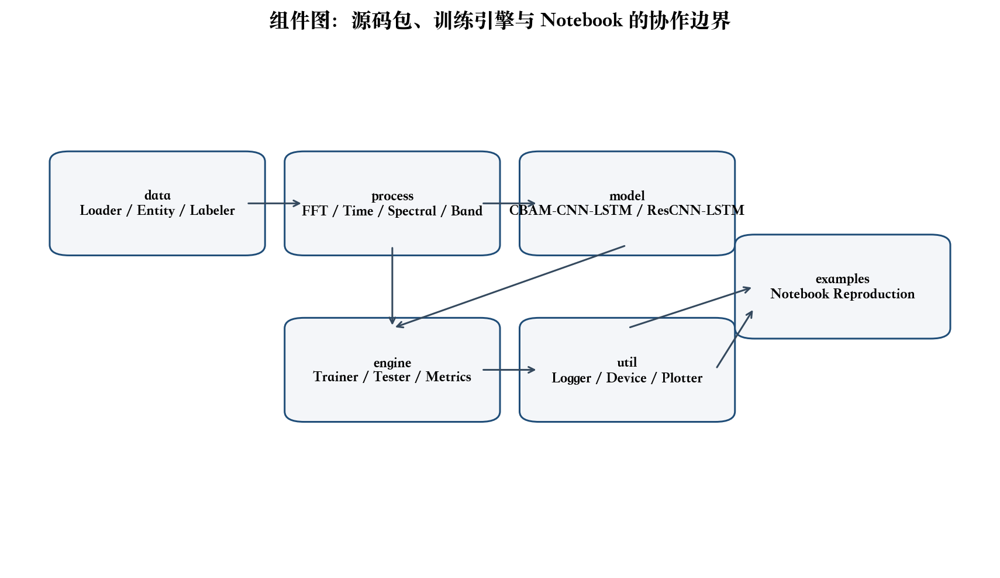
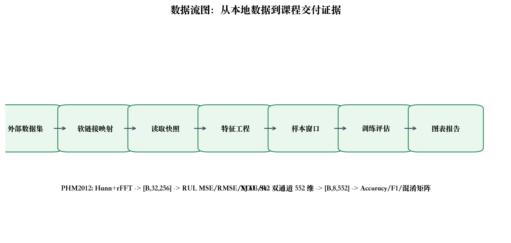

# 轴承寿命预测与故障诊断系统：UML设计文档

| 字段 | 内容 |
|---|---|
| 项目名称 | 轴承寿命预测与故障诊断系统 |
| 小组成员 | zyj、zdh、cyj、zy |
| 组长 | zyj |
| 文档版本 | v1.0 |
| 日期 | 2026年6月 |

## 视图说明

本文档按课程要求给出分解视图、执行视图、实现视图和部署视图。系统是本地实验型软件，部署重点是 Python 环境、数据映射和 Notebook 执行，而不是服务器集群。

## 分解视图

## 执行视图

## 架构视图

## 部署视图

| 节点 | 内容 | 说明 |
|---|---|---|
| 本地开发机 | Python 3.11、uv、PyTorch 2.10 | 执行 Notebook、测试和训练 |
| 数据目录 | `data/external`、`data/loader_roots` | 外部数据通过软链接接入 |
| 代码仓库 | `src`、`tests`、`examples` | 保存源码、测试和示例 |
| 交付目录 | `docx`、`outputs` | 保存文档、PPT 和图表 |
