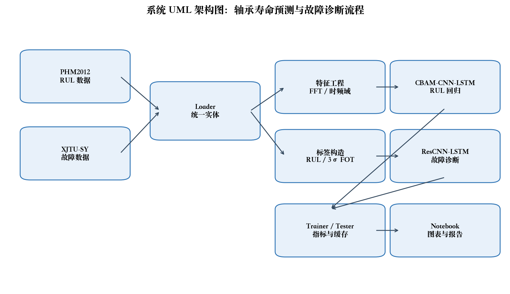
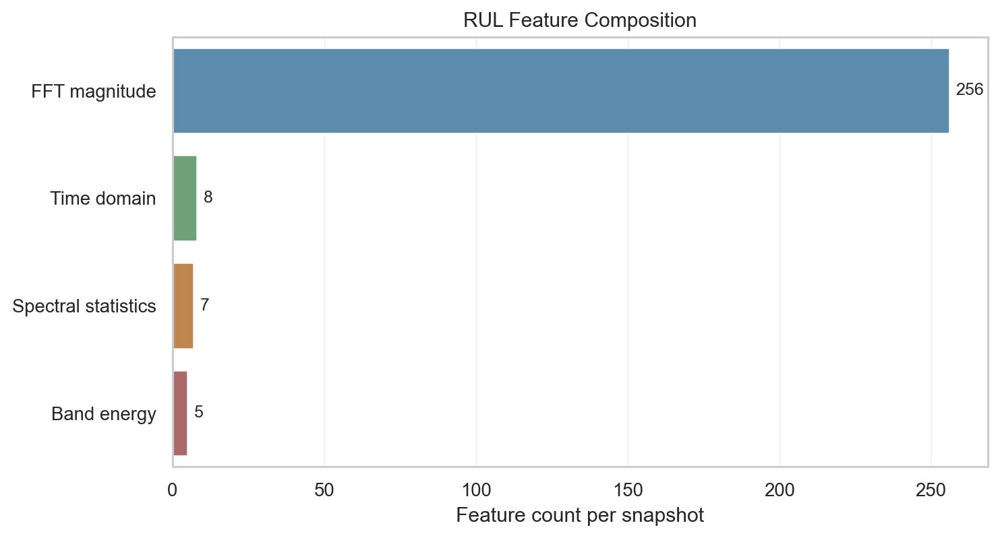

# 轴承寿命预测与故障诊断系统：结题报告

| 字段 | 内容 |
|---|---|
| 项目名称 | 轴承寿命预测与故障诊断系统 |
| 小组成员 | zyj、zdh、cyj、zy |
| 组长 | zyj |
| 文档版本 | v1.0 |
| 日期 | 2026年6月 |

## 项目概述

本项目面向轴承预测性维护课程场景，建设一个可运行、可测试、可复查的轴承寿命预测与故障诊断系统。系统围绕两个公开数据集展开：PHM2012 用于剩余寿命 RUL 回归复现，XJTU-SY 用于健康/故障诊断复现。项目重点不是搭建在线工业平台，而是在本地工程环境中形成从数据接入、特征工程、模型训练、指标评估到文档交付的闭环证据链。

当前代码采用 Python 3.11、uv 包管理和 PyTorch 2.10 依赖范围。源码物理路径为 `src/USTC/SSE/BearingPrediction`，示例和 Notebook 中推荐通过 `from phm...` 导入。数据路径通过 `data/loader_roots/phm2012` 与 `data/loader_roots/xjtu` 映射到本地外部数据集，避免硬编码个人磁盘路径。

## 主线实验摘要

PHM2012 RUL 主线参考论文为《Remaining Useful Life Prediction of Rolling Bearings Based on CBAM-CNN-LSTM》。增强版复现使用 Hann window 后的 rFFT 幅值，移除 DC 分量，取前 256 个 `log1p` 频域 bin，并补充 RMS、峭度、谱心、频带能量等 20 维退化统计特征，按 32 个快照组成序列，模型输入形状为 `[B, 32, 276]`。200 epoch 训练采用 MPS 设备，最佳验证点为 epoch 124，结果记录为 validation MSE 0.002183、test MSE 0.040336、test RMSE 0.2008、test MAE 0.1550。

XJTU-SY 故障诊断主线参考论文为《A Comparative Study on Deep Learning Methods for Fault Diagnosis and Prognosis of Rolling Element Bearings》。本地复现使用 ResCNN-LSTM 二分类模型，输入为 8 个快照窗口，每个快照 552 维特征：双通道各包含 FFT 256 维、8 个时域特征、7 个频域统计特征和 5 个频带能量特征。测试集结果为 accuracy 0.9963、macro-F1 0.9949、fault-F1 0.9922，混淆矩阵为 `[[1043, 3], [2, 318]]`。

## 完成情况

| 类别 | 结题状态 | 证据 |
|---|---|---|
| 数据加载 | 已完成 | PHM2012/XJTU-SY loader 与数据集构造 |
| 特征工程 | 已完成 | FFT、时域、频域、频带能量处理器 |
| RUL 复现 | 已完成主线 | PHM2012 指标图与 Notebook 输出 |
| 故障诊断 | 已完成主线 | XJTU-SY 混淆矩阵与 F1 指标 |
| 测试验证 | 已完成 | 单元、集成、确认测试报告 |
| 文档交付 | 已完成 | Markdown、Word、PDF、图表目录 |

## 结论

系统已形成可运行、可测试、可展示的课程交付闭环。增强训练后 RUL 主线测试误差较旧版 FFT-only 配置明显下降，但跨轴承泛化仍受数据划分、随机种子、退化标签和训练策略影响；故障诊断主线在当前健康/故障二分类设置下指标稳定，适合用于答辩展示。
