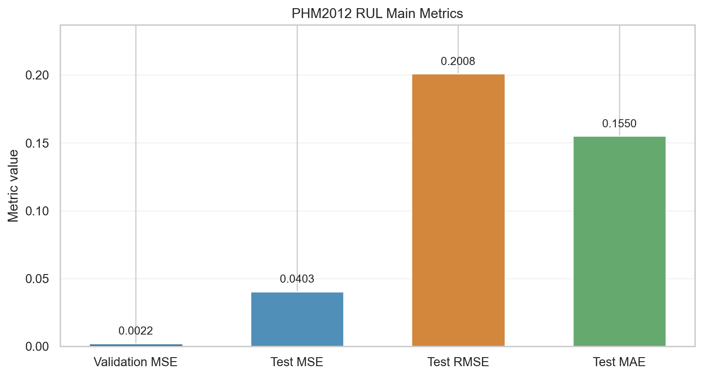
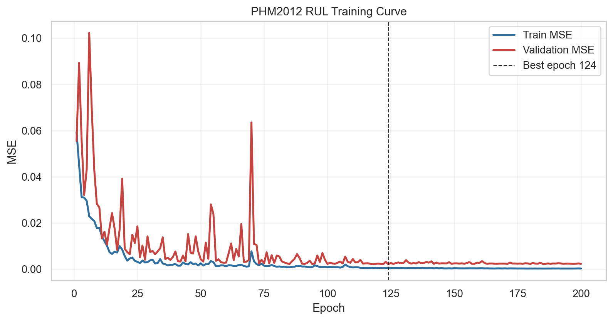
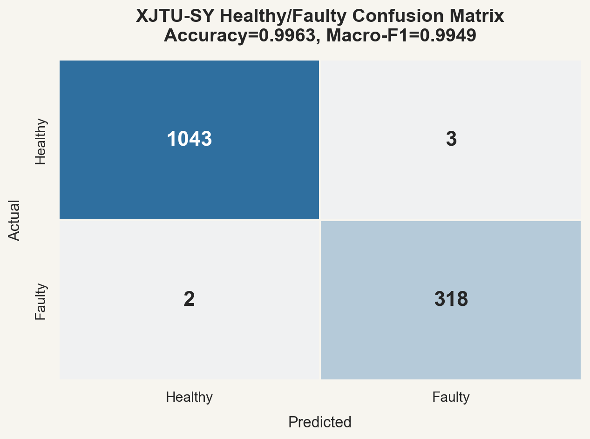

# 轴承寿命预测与故障诊断系统：项目技术论文

| 字段 | 内容 |
|---|---|
| 项目名称 | 轴承寿命预测与故障诊断系统 |
| 小组成员 | zyj、zdh、cyj、zy |
| 组长 | zyj |
| 文档版本 | v1.0 |
| 日期 | 2026年6月 |

## 摘要

本文设计并实现了一个面向课程实践的轴承寿命预测与故障诊断系统。系统以 PHM2012 和 XJTU-SY 为实验对象，建立统一的数据加载、特征工程、模型训练、指标评估和文档交付流程。RUL 主线采用 Hann window、rFFT 频域输入与退化统计特征，复现 CBAM-CNN-LSTM 结构；故障诊断主线采用双通道时频特征与 ResCNN-LSTM 结构，实现健康/故障二分类。实验表明，系统能够在本地环境完成两条主线训练和可视化输出，满足课程工程实践对可运行、可测试、可复查的要求。

## 方法

PHM2012 RUL 方法将每个振动快照转换为 256 维频域向量，并补充 20 维时域、频域和频带能量退化统计特征，按时间顺序组成 32 步序列。CBAM 模块对卷积特征进行注意力加权，LSTM 建模退化时间依赖，输出归一化 RUL。XJTU-SY 故障诊断方法将每个快照转换为 552 维特征，残差卷积块提取局部模式，LSTM 聚合窗口序列，分类头输出健康/故障概率。

## 实验结果

| 任务 | 主指标 | 本地复现结果 |
|---|---|---|
| PHM2012 RUL | Validation MSE | 0.002183 |
| PHM2012 RUL | Test MSE | 0.040336 |
| PHM2012 RUL | Test RMSE | 0.2008 |
| PHM2012 RUL | Test MAE | 0.1550 |
| XJTU-SY 故障诊断 | Accuracy | 0.9963 |
| XJTU-SY 故障诊断 | Macro-F1 | 0.9949 |

## 讨论

RUL 任务比故障诊断更敏感，受数据划分、退化标签、训练 epoch、标准化方式和随机种子影响较大。增强训练降低了整体测试误差，代表性轴承预测曲线能够跟随退化趋势，但部分测试轴承仍存在跨轴承泛化波动。故障诊断任务在二分类设置下较稳定，但若扩展到四类故障类型，还需要重新设计类别均衡和评价指标。

## 参考文献

1. Sun B., Hu W., Wang H., Wang L., Deng C. Remaining Useful Life Prediction of Rolling Bearings Based on CBAM-CNN-LSTM. 2025.
2. Qiao X., Liow H. Y., Jauw V. L., Lim C. S. A Comparative Study on Deep Learning Methods for Fault Diagnosis and Prognosis of Rolling Element Bearings. 2025.
