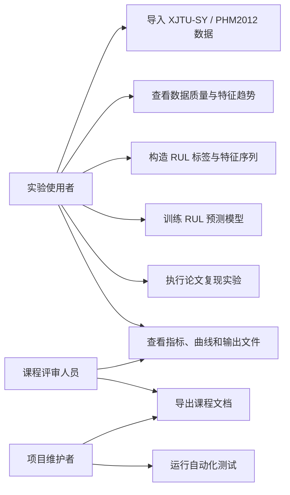
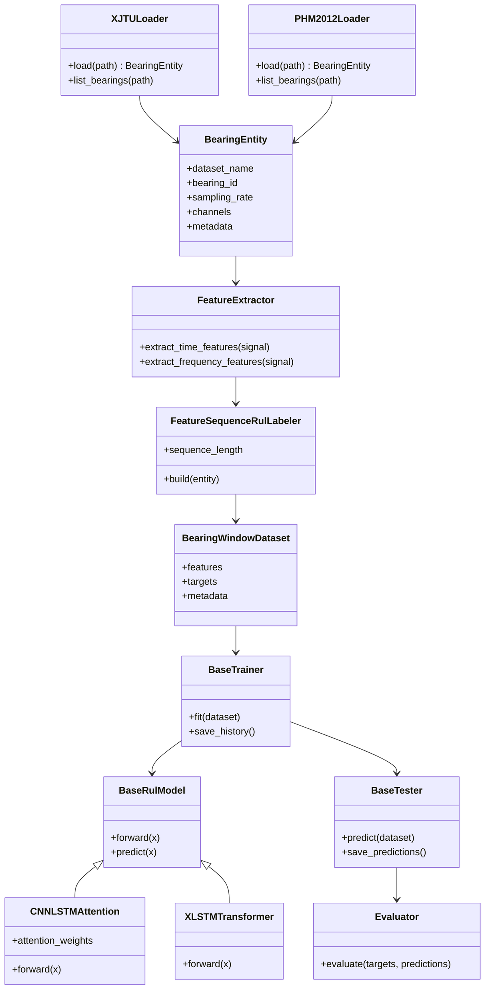
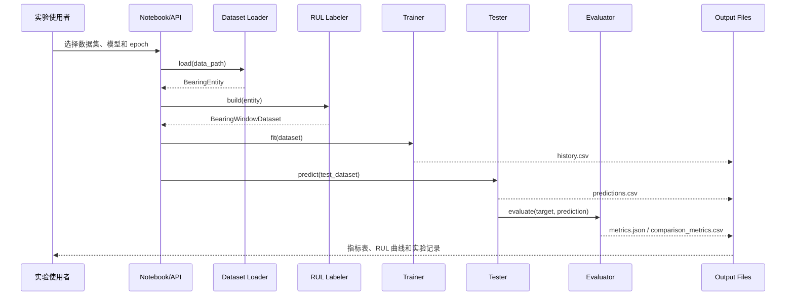
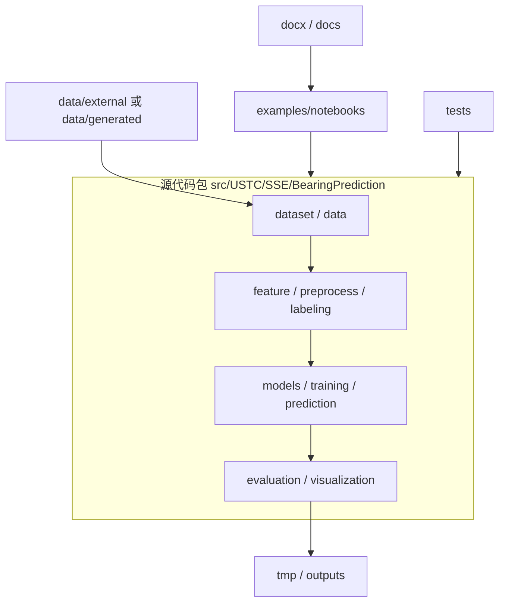
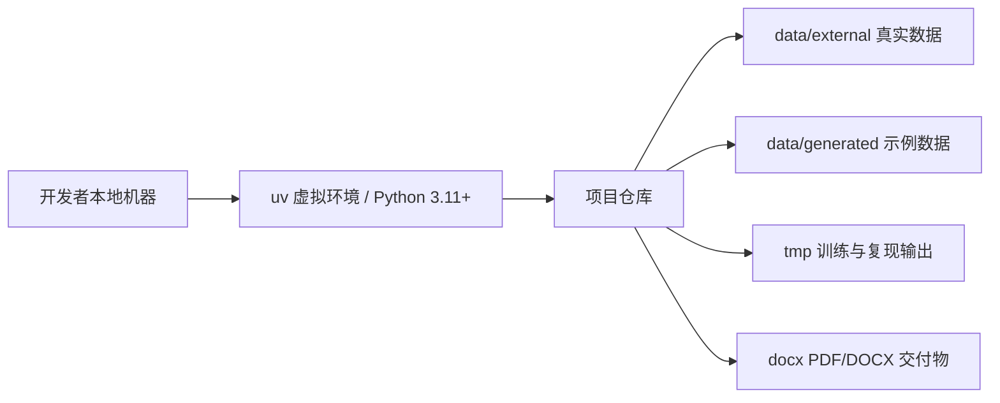

# 工业轴承设备剩余寿命预测系统的实现：UML 设计文档

## 文档信息

| 项目 | 内容 |
| --- | --- |
| 文档名称 | UML 设计文档 |
| 文档编号 | SE-PHM-MID-12 |
| 文档阶段 | 中期 |
| 项目名称 | 工业轴承设备剩余寿命预测系统的实现 |
| 课程 | 中国科学技术大学软件学院《软件工程》 |
| 指导老师 | zjf |
| 小组成员 | zyj、cyy、zdh、zy |
| 文档负责人 | zyj |
| 参与编写 | cyy、zdh、zy |
| 版本 | V3.0 |
| 修订日期 | 2026-06-14 |
| 归档形式 | Markdown 源文件、PDF、DOCX |
| 内容基线 | 用例图、类图、顺序图、组件关系和部署视图 |

## 修订记录

| 版本 | 日期 | 编写人 | 说明 |
| --- | --- | --- | --- |
| V1.0 | 2025-11-10 | 项目组 | 完成初版课程文档 |
| V2.0 | 2026-03-12 | 项目组 | 统一项目名称、技术基线和阶段交付内容 |
| V3.0 | 2026-06-14 | 项目组 | 参考课程交付样例统一封面与归档格式，补充数据理解、技术难点、测试验收和 DOCX 交付信息 |

## 1. 文档目的

本文档用于补充“工业轴承设备剩余寿命预测系统的实现”的 UML 设计说明，明确系统主要参与者、核心类关系、训练与评估顺序、组件边界和部署方式。文档与 `06_设计文档.md` 配套使用，重点回答系统如何从真实轴承数据进入统一工程流程，以及各模块如何协作完成 RUL 预测。

本项目 UML 设计遵循两个原则：

1. 图示服务于工程实现，不额外引入代码中不存在的复杂对象。
2. 图示围绕 RUL 预测主线展开，退化阶段标注、生存概率和可视化作为辅助能力说明。

## 2. UML 建模范围

| 视图 | 关注点 | 对应模块 |
| --- | --- | --- |
| 用例图 | 使用者如何完成数据导入、特征分析、模型训练、论文复现和结果查看 | `dataset`、`feature`、`training`、`evaluation`、`examples` |
| 类图 | 数据实体、loader、特征提取、标签构造、模型、训练器、评估器之间的静态关系 | `src/USTC/SSE/BearingPrediction` |
| 顺序图 | 一次 RUL 训练和评估请求的调用顺序 | loader -> labeler -> trainer -> tester -> evaluator |
| 组件图 | 工程包、notebook、文档和输出目录的边界 | `src`、`examples`、`tests`、`docx`、`outputs` |
| 部署图 | 本地课程环境下的运行和数据存放方式 | Python 3.11、uv、本地数据目录、实验输出目录 |

## 3. 用例图

用例说明：

1. 实验使用者主要关注从数据到训练再到结果解释的完整链路。
2. 课程评审人员主要关注系统是否可运行、结果是否可解释、文档是否规范。
3. 项目维护者主要关注测试、导出脚本和后续扩展。

## 4. 核心类图

类图说明：

1. `XJTULoader` 和 `PHM2012Loader` 只负责数据读取和元数据组织，不参与模型训练。
2. `FeatureExtractor` 将原始振动快照转换为可解释特征，便于跨数据集复用。
3. `FeatureSequenceRulLabeler` 负责将连续特征组织成序列，并生成 RUL 目标。
4. 模型类只处理张量输入输出，训练、测试和指标计算由独立组件负责。

## 5. RUL 训练顺序图

顺序图说明：

1. Notebook 或 API 只是入口，核心计算由包内模块完成。
2. 训练过程必须输出 `history.csv`，用于证明 epoch 循环真实执行。
3. 预测结果与指标分开保存，便于后续画图、复现实验和课程检查。

## 6. 组件图

组件图说明：

1. `src` 是核心工程包，承担可复用逻辑。
2. `examples` 是可执行示例和论文复现实验入口，不应包含大量业务逻辑。
3. `tests` 对核心链路做自动化验证。
4. `docx` 和 `docs` 负责课程交付和用户说明，文档结论应能追溯到示例、测试和输出文件。

## 7. 部署图

部署说明：

1. 项目以本地课程环境为主，不依赖远程工业采集系统。
2. 原始真实数据和训练输出不提交到 Git 仓库，只保留目录约定和可复现说明。
3. 课程文档由 Markdown 源文件导出 PDF 和 DOCX，便于审阅和回溯。

## 8. 设计一致性说明

UML 设计与当前工程实现的对应关系如下：

| UML 元素 | 工程对应 | 验证方式 |
| --- | --- | --- |
| 数据 loader | `XJTULoader`、`PHM2012Loader` | 数据加载测试和 loader overview notebook |
| 特征与标签 | 时频域特征、`FeatureSequenceRulLabeler` | 特征导出 notebook、论文复现 workflow |
| RUL 模型 | CNN、RNN、CNN-LSTM-AM、XLSTM-Transformer | 模型 forward 测试和真实训练记录 |
| 评价器 | RMSE、R2、SMAPE、Huang Score、PHM/RUL 非对称惩罚 Score | RUL 指标单元测试 |
| 输出物 | `history.csv`、`metrics.json`、`predictions.csv`、`comparison_metrics.csv` | 集成测试和确认测试报告 |

## 9. 结论

本文档从用例、类关系、调用顺序、组件边界和部署方式五个角度说明了系统设计。整体设计以 RUL 预测主线为中心，将数据集差异收敛到 loader，将特征和标签构造独立成层，将训练、测试、评价和展示解耦，能够支撑课程要求的实现、测试、复现和文档交付。
