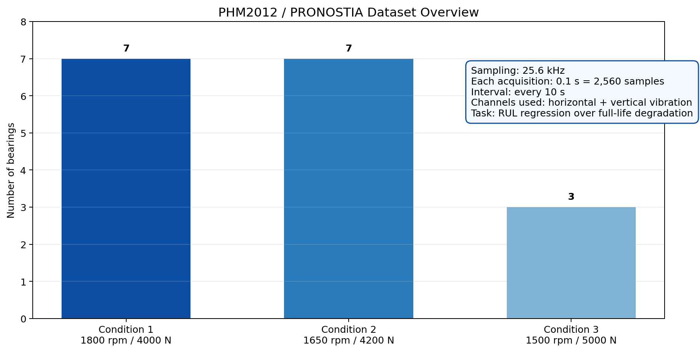
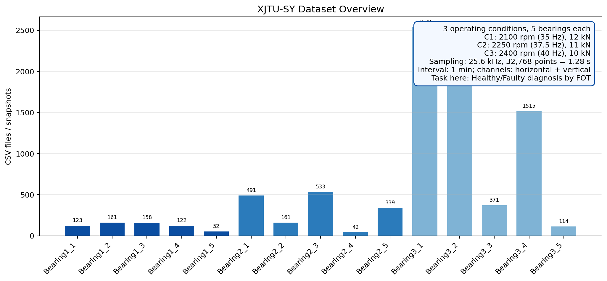
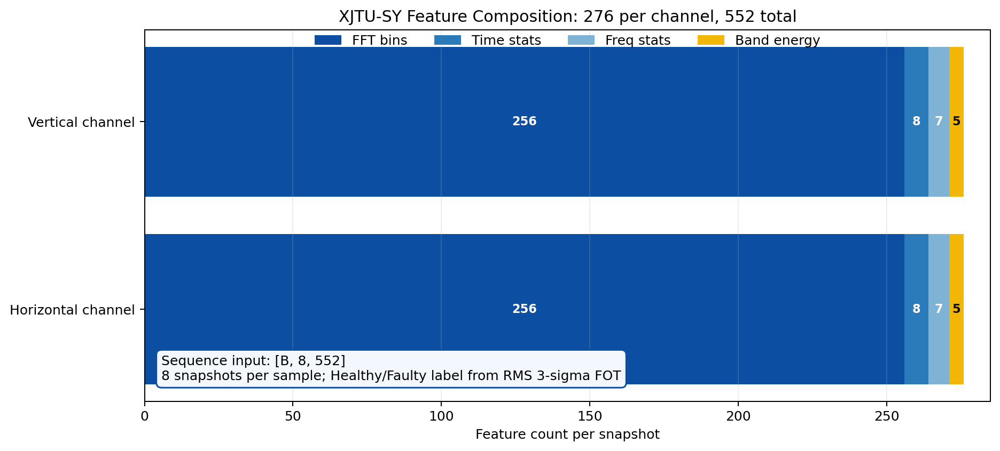
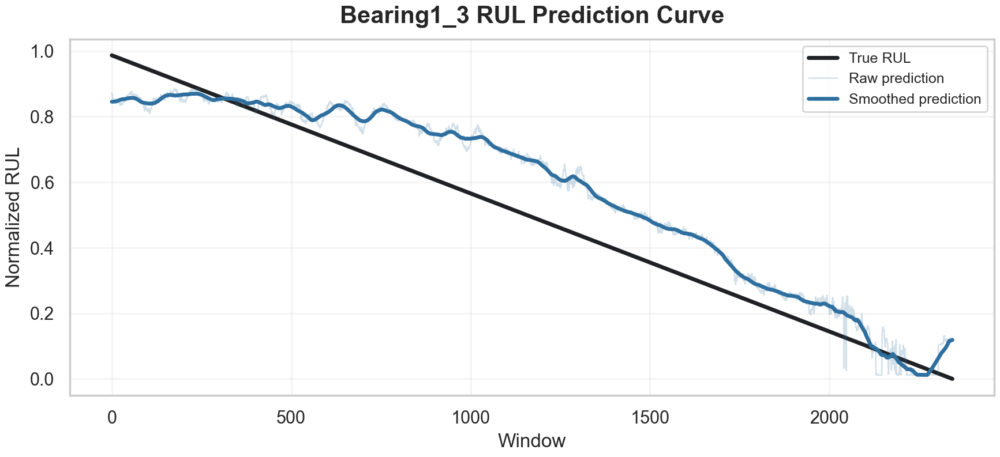

# 轴承寿命预测与故障诊断系统：结题答辩讲稿

> 建议节奏：9 页，约 7-9 分钟。讲法按“为什么做、系统是什么、数据怎么来、训练跑出了什么、谁做了什么”展开。

## 第 1 页：封面

各位老师好，我们小组汇报的题目是《轴承寿命预测与故障诊断系统》。

这个项目围绕轴承预测性维护展开。我们没有把它包装成一个很大的工业平台，而是聚焦两件事：第一，轴承还能运行多久，也就是 RUL 剩余寿命预测；第二，当前轴承状态是否已经进入故障阶段，也就是 Fault 检测。后面的汇报会按背景、系统、数据集、训练例子、分工和总结来讲。

## 第 2 页：背景与意义

先讲为什么要做 RUL 和 Fault。

轴承是旋转机械里非常常见、也很关键的部件。它一旦退化，往往会带来振动增大、噪声升高、精度下降，严重时会导致停机甚至设备损坏。传统维护有两种常见方式：一种是坏了再修，问题是停机不可控；另一种是定期更换，问题是可能还没坏就被换掉，成本比较高。

RUL 预测解决的是“还能用多久”的问题。它可以帮助维护人员提前安排检修时间，避免突然停机。Fault 检测解决的是“现在是不是已经异常”的问题。它可以作为早期报警，提醒系统进入重点监控或维护流程。

所以这个系统的作用可以概括成一句话：用轴承振动数据，把维护决策从事后维修，往预测性维护推进。课程项目里我们重点证明这条流程能跑通、能复现论文主线、能输出可检查的图和指标。

## 第 3 页：系统介绍与 UML 架构

这一页介绍系统本身。

系统整体可以分成四层。第一层是数据接入层，负责读取 PHM2012 和 XJTU-SY 的原始振动信号，并统一整理成后续模块可以处理的数据对象。第二层是信号处理与特征层，负责完成窗口切分、频域变换、统计特征提取，以及 RUL 标签和 Fault 标签构造。第三层是任务模型层，根据任务类型分成两条路径：RUL 预测走回归模型，输出剩余寿命曲线；Fault 检测走分类模型，输出健康或故障状态。第四层是训练评估层，统一完成训练、指标计算和结果输出。

这里 UML 图想表达的是：系统不是把两个实验孤立放在一起，而是用同一套数据流把它们组织起来。原始信号先进入数据层，再进入特征层；特征层之后按照任务分流，一路进入 RUL 回归分支，一路进入 Fault 分类分支；最后两个分支都回到统一的训练和评估模块，输出指标、曲线和诊断结果。这样系统的核心逻辑就是“数据接入、特征构造、任务建模、训练评估”四步。

## 第 4 页：数据集一 PHM2012 与 RUL 特征分析

第一个数据集是 PHM2012，也就是 FEMTO-ST 的 PRONOSTIA 轴承退化数据。它记录的是轴承从健康运行到逐渐退化、最后接近失效的完整过程，所以适合做 RUL 剩余寿命预测。

数据集一共有 3 个工况。工况一是 1800 rpm、4000 N，包含 Bearing1_1 到 Bearing1_7 共 7 个轴承；工况二是 1650 rpm、4200 N，包含 Bearing2_1 到 Bearing2_7 共 7 个轴承；工况三是 1500 rpm、5000 N，包含 Bearing3_1 到 Bearing3_3 共 3 个轴承。采样频率是 25.6 kHz，每 10 秒采集一次，每次采集 0.1 秒，也就是 2560 个采样点。数据包含水平和垂直两个方向的振动信号，我们当前 RUL 主线主要使用振动信号做退化建模。

在我们的系统里，PHM2012 的标签不是人工写死的类别，而是按寿命过程构造的连续值：开始阶段接近 1，随着运行时间增加逐步下降到 0。模型要学习的是振动信号中的退化趋势，然后输出当前窗口对应的归一化 RUL。

特征方面，我们先对每个振动快照做 Hann window，减少频谱泄漏，然后做 rFFT，去掉 DC 分量，取前 256 个 `log1p` 频域 bin。除此之外，我们还加入 20 维手工退化特征，例如 RMS、峭度、谱心和频带能量。这样一个快照是 276 维，训练时用 32 个连续快照组成一个序列，输入形状是 `[B, 32, 276]`。

这一页的特征分析图主要展示两点：第一，频域特征占主要输入维度；第二，统计特征补充了退化强度信息。也就是说，模型既能看到频谱形态，也能看到 RMS、能量等更容易解释的健康指标。

## 第 5 页：数据集二 XJTU-SY 与 Fault 特征分析

第二个数据集是 XJTU-SY 轴承数据集。它同样是滚动轴承加速退化数据，但规模和采样形式与 PHM2012 不同。XJTU-SY 一共有 15 个轴承，分布在 3 个工况下，每个工况 5 个轴承。

三个工况分别是：工况一 2100 rpm，也就是 35 Hz，载荷 12 kN；工况二 2250 rpm，也就是 37.5 Hz，载荷 11 kN；工况三 2400 rpm，也就是 40 Hz，载荷 10 kN。采样频率同样是 25.6 kHz，但它每 1 分钟采集一次，每次采集 1.28 秒，也就是 32768 个采样点。每个 CSV 文件包含两列：水平振动信号和垂直振动信号。

这里的标签不是逐文件手工标注，而是根据 RMS 的 3σ 首次故障点自动生成。具体做法是先取每个轴承前 30% 的样本作为健康基线，计算 RMS 均值和标准差；当后续样本连续超过阈值后，就把首次越界点作为 FOT，也就是 First Occurrence Time。FOT 之前标为 Healthy，之后标为 Faulty。

特征方面，XJTU-SY 使用双通道时频特征。每个通道包含 256 维 FFT 频域特征、8 个时域特征、7 个频域统计特征和 5 个频带能量特征，双通道合计 552 维。训练时使用 8 个快照组成一个序列，所以输入形状是 `[B, 8, 552]`。

这一页的特征图和热力图主要用来说明：健康状态和故障状态在 RMS、频带能量和频谱分布上会出现明显差异。也正因为当前是二分类任务，模型学到的是健康到故障的状态边界，而不是更细的内圈、外圈、滚动体等多故障类型分类。

## 第 6 页：训练例子一 PHM2012 RUL

接下来讲第一个训练例子，PHM2012 的 RUL 预测。

RUL 主线使用的是 CBAM-CNN-LSTM。CNN 用来提取局部特征，CBAM 用来对通道和时间位置做注意力加权，LSTM 用来建模 32 个快照之间的退化时间依赖，最后输出一个归一化 RUL 值。

本次全量训练使用 `BaseTrainer` 跑完整流程，训练轮数设置为 200，设备使用 Mac 上的 MPS。训练过程中保存最佳验证点、checkpoint、标准化参数、预测 CSV 和可视化图。最终最佳验证点在 epoch 124，validation MSE 为 0.002183；测试集 MSE 为 0.040336，RMSE 为 0.2008，MAE 为 0.1550。

这一页可以先用表格讲清楚训练输出：

| 输出项 | 数值或文件 | 说明 |
| --- | --- | --- |
| 输入形状 | `[B, 32, 276]` | 32 个连续快照，每个快照 276 维特征 |
| 训练窗口 | 6246 | 参与参数更新的序列样本 |
| 验证窗口 | 1102 | 用于选择最佳 checkpoint |
| 测试窗口 | 17014 | 用于全量测试集评估 |
| 最大训练轮数 | 200 | 使用 `BaseTrainer` 完整训练 |
| 最佳 epoch | 124 | 按 validation MSE 选择 |
| Validation MSE / RMSE / MAE | 0.002183 / 0.0467 / 0.0216 | 验证集拟合较好 |
| Test MSE / RMSE / MAE | 0.040336 / 0.2008 / 0.1550 | 全量测试集指标 |
| 主要输出文件 | `phm2012_rul_enhanced_results.json`、`phm2012_rul_enhanced_predictions.csv` | 保存指标和逐窗口预测结果 |

讲第一张图的时候可以说：训练曲线能看到模型在前期快速下降，后期趋于稳定；验证曲线最低点出现在 epoch 124，所以最终选择这一轮作为最佳模型。

讲第二张图的时候可以说：RUL 预测曲线整体跟随真实寿命下降趋势，但不同轴承上的拟合程度仍有差异。这说明主线流程已经跑通，但如果要追论文最优，还需要继续做跨轴承泛化、随机种子和更严格的数据划分对齐。

## 第 7 页：训练例子二 XJTU-SY Fault

第二个训练例子是 XJTU-SY 的故障检测。

Fault 主线使用 ResCNN-LSTM。前面的残差卷积块处理 552 维特征序列，提取局部模式；后面的 LSTM 聚合 8 个快照窗口；最后分类头输出 Healthy 和 Faulty 两类概率。它和 RUL 最大的区别是：RUL 是回归问题，输出连续寿命值；Fault 是分类问题，输出当前状态类别。

这条主线的测试结果比较高：Accuracy 为 0.9963，Macro-F1 为 0.9949。混淆矩阵中，Healthy 样本有 1043 个判断正确、3 个误判为 Faulty；Faulty 样本有 318 个判断正确、2 个误判为 Healthy。

这一页同样先用表格讲训练输出：

| 输出项 | 数值或文件 | 说明 |
| --- | --- | --- |
| 输入形状 | `[B, 8, 552]` | 8 个连续快照，每个快照 552 维双通道特征 |
| 任务类别 | Healthy / Faulty | 二分类故障检测 |
| 模型 | ResCNN-LSTM | 残差卷积提局部模式，LSTM 聚合时间窗口 |
| 训练轮数 | 35 | 使用 `BaseTrainer` 训练 |
| 损失函数 | CrossEntropyLoss | 分类交叉熵 |
| 优化器 / 学习率 | AdamW / 0.001 | 主线实验配置 |
| Batch size | 100 | 每批序列样本数 |
| Test loss | 0.0214 | 测试集分类损失 |
| Accuracy | 0.9963 | 整体分类正确率 |
| Macro-F1 / Weighted-F1 / Fault-F1 | 0.9949 / 0.9963 / 0.9922 | 兼顾类别均衡和故障类表现 |
| 混淆矩阵 | `[[1043, 3], [2, 318]]` | 行是真实类别，列是预测类别 |
| 论文对比 | Paper Acc/F1 0.9639/0.9640；Ours Acc/F1 0.9963/0.9963 | 当前二分类主线达到可复现展示效果 |

讲图的时候可以说：混淆矩阵左上和右下的数量占绝大多数，说明 Healthy 和 Faulty 两类边界比较清楚；误判主要只有 5 个样本。

这里答辩时要主动讲清楚边界：这个结果高，是因为当前任务是 Healthy/Faulty 二分类，而且标签来自 RMS 3σ 首次故障点，模型输入里也包含 RMS 和频带能量等强相关特征。因此这个结果可以说明故障检测闭环有效，但不能夸大成多故障类型诊断已经完成。

## 第 8 页：成员分工

这一页讲成员分工。我们按代码模块和交付任务来分，而不是只写一个笼统比例。

| 成员 | 贡献比例 | 主要负责内容 |
| --- | ---: | --- |
| 蔡祎珏 | 25% | 数据加载、数据实体、PHM2012/XJTU-SY 数据适配、标签构造 |
| 朱德豪 | 25% | 训练流程、Trainer/Evaluator、实验运行、指标记录 |
| 周逸进 | 25% | 模型结构、论文主线复现、项目整合、答辩材料组织 |
| 邹扬 | 25% | 工具函数、可视化图表、测试用例、Notebook 示例、实验结果整理和交付检查 |

口头讲的时候可以简化成：项目按数据、训练、模型、工具测试四条线分工。四个人贡献比例默认各 25%，但每个人对应的模块和交付物不同。这样代码头、文档、测试和实验记录都能对应到具体责任。

## 第 9 页：感谢与总结

最后做一个总结。

本项目围绕轴承 PHM 做了两条主线：第一条是 PHM2012 的 RUL 预测，用来回答轴承还能运行多久；第二条是 XJTU-SY 的故障检测，用来回答当前是否已经进入故障阶段。系统层面，我们完成了数据加载、特征工程、模型训练和评估输出。实验层面，RUL 和 Fault 都能跑完整流程，并输出图表和指标。

当然这个项目还有继续改进的空间。RUL 方向可以继续加强跨轴承泛化和论文参数对齐；Fault 方向可以从 Healthy/Faulty 二分类扩展到多故障类型诊断。

我的汇报到这里。感谢老师的指导，也感谢各位同学在数据、模型、实验和文档上的配合。谢谢老师。

## 可能被问到的问题

**1. 为什么这个系统有实际意义？**  
答：RUL 可以辅助安排检修计划，减少突发停机；Fault 检测可以作为早期报警，提示当前状态已经异常。它们共同服务于预测性维护。

**2. RUL 输入到底是什么？**  
答：每个快照是 Hann window + rFFT 后的 256 个频域 bin，再加 20 维退化统计特征，合计 276 维；32 个快照组成一个序列，所以输入是 `[B, 32, 276]`。

**3. Fault 标签是怎么来的？**  
答：用每个轴承前 30% 样本建立 RMS 健康基线，后续连续超过 3σ 阈值的位置作为首次故障点 FOT，之前是 Healthy，之后是 Faulty。

**4. Fault 分数为什么很高？**  
答：因为当前是 Healthy/Faulty 二分类，且标签和特征都与 RMS、能量变化强相关，所以分类边界比较清楚。这个结果说明二分类检测有效，不代表多故障类型识别已经完成。

**5. 系统和零散实验脚本有什么区别？**  
答：系统把数据加载、特征工程、模型训练、评估输出和可视化组织成统一流程，训练走 `BaseTrainer`，结果有 JSON、CSV、指标、图表和测试支撑，不只是单次实验能跑。
